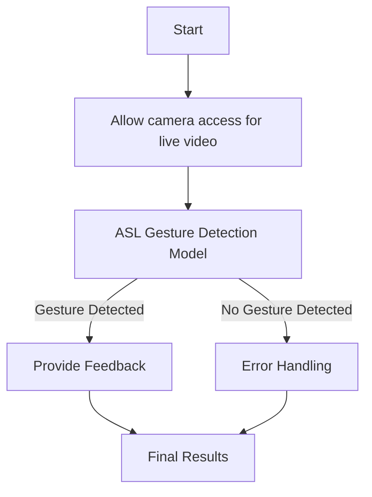

<div style="text-align: center;">
  
</div>


Our mission is to empower individuals through accessible and engaging American Sign Language (ASL) education. We strive to create an inclusive community where learners of all ages can develop their signing skills, foster cultural understanding, and promote effective communication. By providing innovative learning tools, interactive resources, and real-time feedback, we aim to enhance the ASL learning experience through Machine Learning, ensuring that every learner feels confident and supported on their journey to fluency.

# Table of Contents
- [Mission](#hands2words)
- [Setting up React](#setting-up-react)
  - [Run The Frontend](#run-the-frontend)
- [Setting up the Backend](#setting-up-the-backend)
  - [Install Anaconda](#install-anaconda)
  - [Create Virtual Environment](#create-virtual-environment)
  - [Install Requirements](#install-requirements)
  - [Run Server](#run-server)
  - [Deactivate Environment](#deactivate-environment)
- [Workflow Overview](#workflow-overview)
- [Pretrained Model](#pretrained-model)

### Built With


# Both the frontend and backend need to be started up. 

# Setting up React 
```bash
npm install
```
This will retrieve all node modules. 

# Run The Frontend 
```bash
npm run start
```
This will start the frontend.

# Setting up the Backend 

## Install Anaconda
Go to [Anaconda](https://www.anaconda.com/download). 
Make sure you download the installer and the PowerShell prompt. 

## Create Virtual Environment
Once installed, navigate to the backend folder:
```bash
cd backend
```

## Open up Anaconda PowerShell Prompt and create a virtual environment:
```bash
conda create --name modelenv python=3.11
conda activate modelenv
```

## Install Requirements
While the virtual environment is running, install the necessary packages:
```bash
pip install -r requirements.txt
```

## Run Server
Go back to VS Code. Open the command palette:
```bash
ctrl + shift + p
```
Click "Python: Select Interpreter" and choose the new Conda environment.

To run the server:
```bash
python manage.py runserver
```

## Deactivate Environment
To deactivate the environment:
```bash
conda deactivate
```

# Workflow Overview
Below is a simplified workflow for Hands2Words:



**Pretrained Model**

This project uses a pretrained LSTM-based model for sign language detection, developed by Avishake Adhikary. The model implementation is available in the following repository:

Adhikary, A. (n.d.). *Realtime Sign Language Detection Using LSTM Model*. GitHub. Retrieved from [https://github.com/AvishakeAdhikary/Realtime-Sign-Language-Detection-Using-LSTM-Model](https://github.com/AvishakeAdhikary/Realtime-Sign-Language-Detection-Using-LSTM-Model/blob/main/RealTimeSignLanguageDetection.ipynb?short_path=e69d5f1).

This model was created as part of a project at Amity University Kolkata under the guidance of Prof. Soma Debnath.
